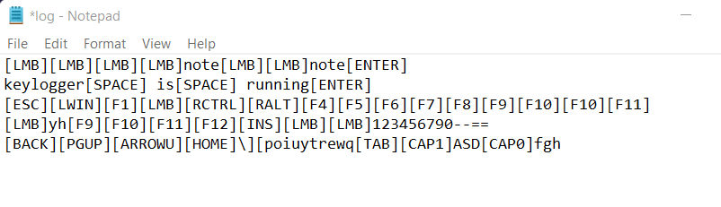

# Keylogger Application

## Problem Statement

Design a keylogger.

## Overview

Keylogger app is a C++ application that has basic functionalities of key logging software. Three primary goals of this app are:

1. Execute in hidden mode in background.
2. Detect and capture Keystrokes.
3. Save keystrokes log in a text file.

## Description

This keylogger supports the following characters and symbols:

```
[ESC][F1][F2][F3][F4][F5][F6][F7][F8][F9][F10][F11][F12]
`1234567890-=
~!@#$%^&*()_+
qwertyuiop[]\asdfghjkl;'zxcvbnm,./
QWERTYUIOP{}|ASDFGHJKL:"ZXCVBNM<>?
[TAB][C0][C1][SHIFT][LCTRL][LWIN][LALT][SPACE][RALT][RWIN][MENU][RCTRL][ENTER][BACK]
[DEL][INS][END][HOME][PGDN][PGUP][ARROWD][ARROWU][ARROWL][ARROWR]
```

## Technology used

- C++

## Resources Used

- [GetAsyncKeyState function](https://docs.microsoft.com/en-us/windows/win32/api/winuser/nf-winuser-getasynckeystate)
- [Virtual-Key Codes](https://github.com/sepehrsohrabi/Decimal-Virtual-Key-Codes)

## Note
- FreeConsole(): Detaches the calling process from its console. It helps in running the program in background.
- GetAsyncKeyState() can't tell the difference between upper and lower case letters. We would need to take SHIFT and CAPSLOCK into account in order to determine case.

## How to Run Keylogger [Using an IDE]

1. Clone this repository from GitHub: $ https://github.com/aksuman055/keylogger

2. Open _keylogger.cpp_ and change the maximum number of key strokes you wish to record (_max_ constant)
3. Compile with MinGW: g++ keylogger.cpp -o keylogger.exe
4. Run _keylogger.exe_
5. The program will terminate after a certain number(_max_ constant) of key strokes.
6. Inspect _log.txt_

Note: Disable any antivirus software.

## Output

_log.txt_ output:


